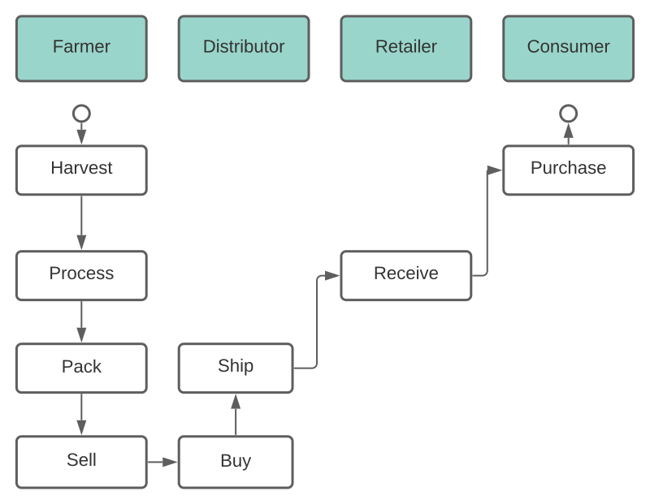
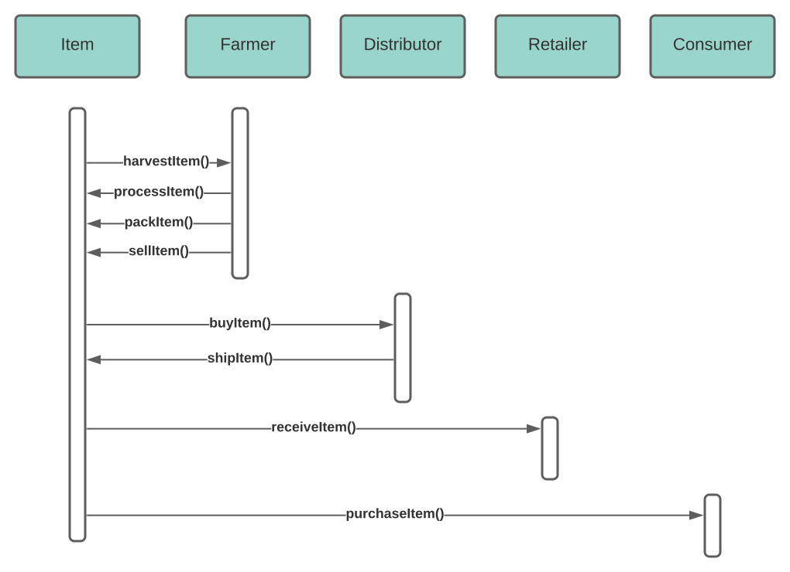
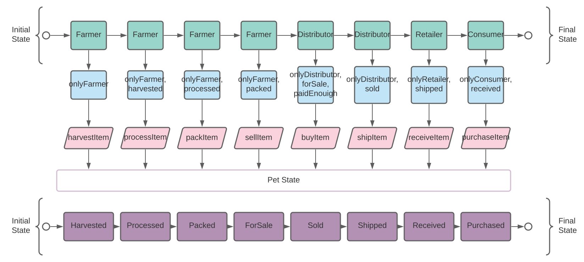
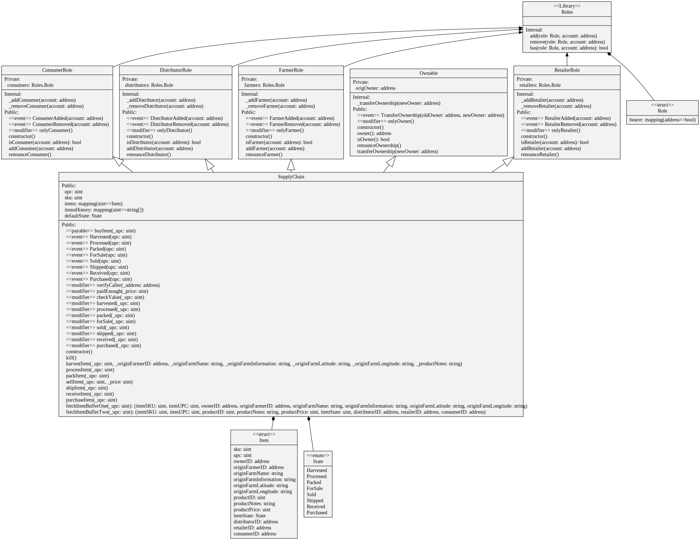

### Contract Address
0xdEA26baEB0D3FD113Ec90F96C6e088cC008eB0B3  
[Etherscan](https://rinkeby.etherscan.io/address/0xdEA26baEB0D3FD113Ec90F96C6e088cC008eB0B3)

### Node Version
v17.2.0

### Truffle Version
v5.4.22

### Web3 Version
1.6.1

### UML Docs

#### Activity

#### Sequence

#### State

#### Class (Data Model)
